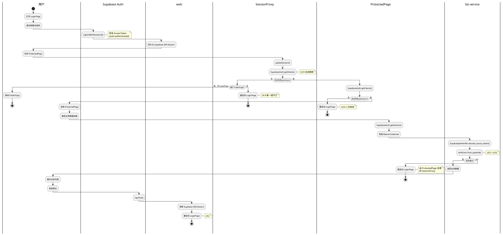
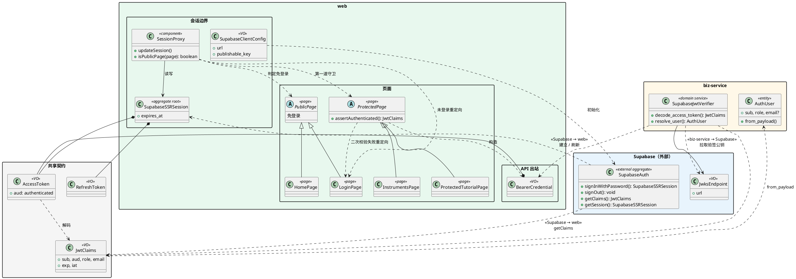
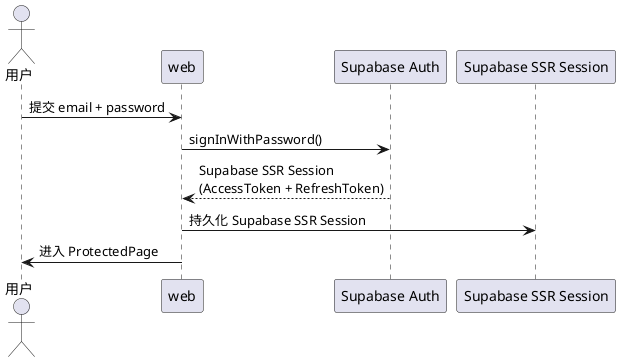
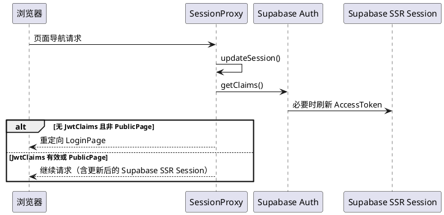
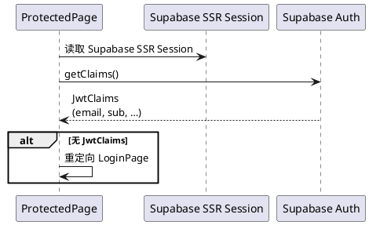
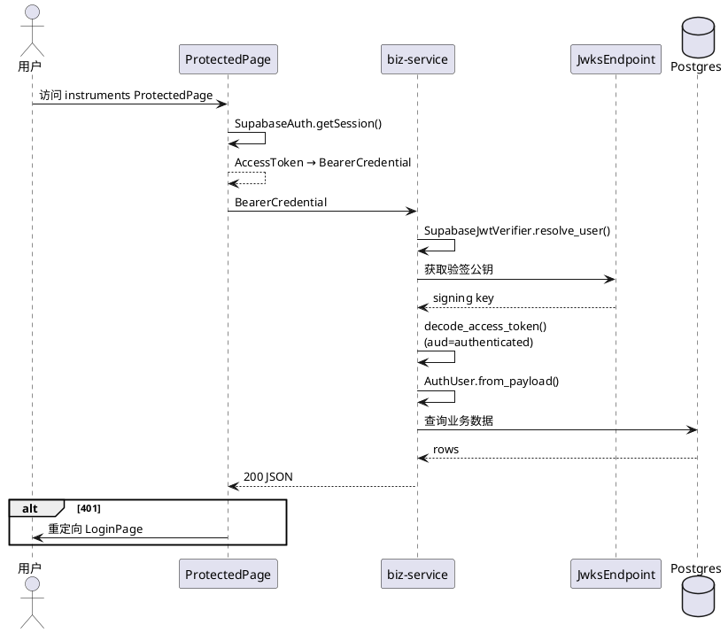

# Supabase Solution

## Background

本 feature 在 **web** 与 **biz-service** 之间建立基于 Supabase Auth 的统一身份体系：用户在 web 端登录后获得 `Supabase SSR Session` 与 `AccessToken`；受保护页面与业务 API 分别通过 `JwtClaims` 与 `SupabaseJwtVerifier` 识别已登录用户。

相关 use cases：

| # | Use case |
|---|----------|
| UC1 | 邮箱 + 密码登录，成功后进入 `ProtectedPage` |
| UC2 | 登出并清除 `Supabase SSR Session` |
| UC3 | `SessionProxy` 自动刷新 `Supabase SSR Session` |
| UC4 | 未登录访问 `ProtectedPage` 时重定向至 `LoginPage`（`SessionProxy` 守卫 + `ProtectedPage` 内 `JwtClaims` 二次校验） |
| UC5 | 客户端以 `BearerCredential` 调用 biz-service 受保护 API |
| UC6 | biz-service 通过 `JwksEndpoint` 与 `SupabaseJwtVerifier` 校验 `BearerCredential`，解析为 `AuthUser` |

### Out Of Scope

- **注册新账号 / 邮箱确认**：`SupabaseAuth.signUp` 与 OTP 确认流程。
- **忘记密码 / 重置密码**：`SupabaseAuth.resetPasswordForEmail` 与密码更新流程。
- **OAuth / 社交登录**（Google、GitHub 等）：当前仅实现 email/password 登录。
- **MFA / 手机号登录**：未集成。
- **biz-service 细粒度授权**：仅校验 JWT 有效且 `aud=authenticated`，不基于 `role` 做 RBAC（`AuthUser.role` 已解析但未用于路由授权）。
- **PostgREST / Supabase RLS**：biz-service 直连 Postgres，绕过 RLS；授权需在应用层实现。
- **Service Role / 服务端代用户操作**：web 仅使用 publishable key，无 service role 调用。
- **生产环境 API 网关路由细节**：开发环境经 Biz API 代理转发；生产 Biz API 由部署层配置，不在本仓库 web 代码中硬编码。

## Terminology

| 术语 | 英文统一标识 | 解释 |
|------|-----------------|------|
| Supabase 项目 | Supabase Project | 托管 Auth、Postgres 与 JWKS 的 Supabase 云项目或本地 CLI 实例。 |
| Supabase 客户端配置 | SupabaseClientConfig | web 端连接 Supabase Project 的配置值对象。 |
| Supabase Auth | Supabase Auth | 外部身份验证聚合；签发 JWT，管理登录与会话生命周期。 |
| SSR 会话 | Supabase SSR Session | web 端会话聚合根；持久化 `AccessToken` 与 `RefreshToken`。 |
| Access Token | AccessToken | JWT 凭证；短期有效，`aud` 为 `authenticated`，携带 `sub`、`role`、`email` 等 claims。 |
| Refresh Token | RefreshToken | 长期刷新凭证；由 `SessionProxy` 随 `Supabase SSR Session` 一并维护，应用层通常不直接读取。 |
| JWT Claims | JwtClaims | 自 `AccessToken` 解码的用户声明值对象；含 `sub`、`aud`、`role`、`email`、`exp`、`iat` 等字段。 |
| 会话 Proxy | SessionProxy | web 端会话边界；负责 `Supabase SSR Session` 读写与页面访问守卫。 |
| 公开页面 | PublicPage | 免登录页面抽象；子类型含 `LoginPage`、`HomePage` 及 Auth 相关公开页。 |
| 受保护页面 | ProtectedPage | 需有效 `Supabase SSR Session` 的页面抽象；子类型如 `InstrumentsPage`、`ProtectedTutorialPage`；渲染边界执行 `assertAuthenticated()`。 |
| 登录页 | LoginPage | `PublicPage` 子类型；未登录访问 `ProtectedPage` 时的重定向目标。 |
| 首页 | HomePage | `PublicPage` 子类型。 |
| JWKS 端点 | JwksEndpoint | biz-service 验签配置；Supabase Project 在此发布 JSON Web Key Set。 |
| JWT 验签器 | SupabaseJwtVerifier | biz-service 领域服务；基于 `JwksEndpoint` 缓存公钥并验签 `AccessToken`。 |
| 已认证用户 | AuthUser | biz-service 实体；由验签后的 `JwtClaims` 映射而来，含 `sub`、`role`、可选 `email`。 |
| Bearer 凭证 | BearerCredential | 携带 `AccessToken` 的 HTTP 授权头值对象。 |

## 主业务流程

端到端主路径：登录建立 `Supabase SSR Session` → 访问 `ProtectedPage` 经页面守卫 → `ProtectedPage` 加载业务数据并经 `BearerCredential` 鉴权 → 登出清除会话。

## 领域模型关系

模型按四层组织：**共享契约**（跨端 JWT 语义）、**Supabase 外部**、**web**、**biz-service**。web 内再分为**会话边界**、**页面**、**API 出站**三个子域，避免会话组件与页面 taxonomy 混在同一层。

### 类图

### 关系说明

#### 共享契约

| 模型 | 说明 |
|------|------|
| `AccessToken` | JWT 字符串；`aud=authenticated`；web 持有，biz-service 验签 |
| `RefreshToken` | 刷新凭证；仅随 `SupabaseSSRSession` 在 web 维护 |
| `JwtClaims` | 解码后的声明；web 用于页面守卫，biz-service 用于映射 `AuthUser` |

#### web 内部

| 子域 | 模型 | 关系 |
|------|------|------|
| 会话边界 | `SupabaseSSRSession` | 聚合根；组合 `AccessToken`、`RefreshToken` |
| 会话边界 | `SessionProxy` | 读写 `SupabaseSSRSession`；刷新会话；页面访问守卫 |
| 会话边界 | `SupabaseClientConfig` | 初始化 `SupabaseAuth` 客户端 |
| 页面 | `PublicPage` | 抽象；子类型 `LoginPage`、`HomePage` 免登录 |
| 页面 | `ProtectedPage` | 抽象；子类型如 `InstrumentsPage`、`ProtectedTutorialPage`；渲染前 `assertAuthenticated()` |
| API 出站 | `BearerCredential` | 由 `ProtectedPage` 从 `AccessToken` 构造，供 biz-service 调用 |

`SessionProxy` 不直接依赖各页面子类，而是通过 `isPublicPage()` 判定请求是否属于 `PublicPage`；否则视为 `ProtectedPage` 并校验 `JwtClaims`。

#### biz-service 内部

| 模型 | 关系 |
|------|------|
| `SupabaseJwtVerifier` | 依赖 `JwksEndpoint`；解码 `BearerCredential` 为 `JwtClaims` |
| `AuthUser` | 由 `JwtClaims.from_payload()` 映射；注入受保护 API 处理链 |

#### 跨边界协作

| 方向 | 协作 |
|------|------|
| Supabase → web | `SupabaseAuth` 建立/刷新 `SupabaseSSRSession`；`getClaims()` 返回 `JwtClaims` |
| web → biz-service | `ProtectedPage` 发送 `BearerCredential`；`SupabaseJwtVerifier.resolve_user()` 解析身份 |
| biz-service → Supabase | `SupabaseJwtVerifier` 从 `JwksEndpoint` 拉取验签公钥 |

**边界说明**

| 限界上下文 | 职责 | 核心模型 |
|------------|------|----------|
| 共享契约 | 跨端 JWT 载荷语义 | `AccessToken`、`RefreshToken`、`JwtClaims` |
| Supabase（外部） | 身份验证与 JWKS 发布 | `SupabaseAuth`、`JwksEndpoint` |
| web · 会话边界 | 会话持久化与页面访问守卫 | `SupabaseSSRSession`、`SessionProxy`、`SupabaseClientConfig` |
| web · 页面 | 公开/受保护页面 taxonomy | `PublicPage`、`ProtectedPage` 及具体页面 |
| web · API 出站 | 构造后端调用凭证 | `BearerCredential` |
| biz-service | JWT 验签与用户身份注入 | `SupabaseJwtVerifier`、`AuthUser` |

## 模块间的集成

### 步骤 1：用户登录（web ↔ Supabase Auth）

### 步骤 2：`SessionProxy` 会话刷新与页面守卫（web 内部）

**PublicPage**：含 **`LoginPage`、`HomePage`** 及 Auth 公开页。

**ProtectedPage**：不属于 `PublicPage` 的页面即需有效 `Supabase SSR Session`（如 `InstrumentsPage`、`ProtectedTutorialPage`）。

### 步骤 3：`ProtectedPage` 二次校验（web 内部）

`ProtectedPage` 渲染边界用 `SupabaseAuth.getClaims()` 判断登录态；需向 biz-service 发起请求时，用 `SupabaseAuth.getSession()` 获取 `AccessToken` 并构造 `BearerCredential`。

### 步骤 4：调用 biz-service 受保护 API（web → biz-service → JWKS）

以 instruments 页为例：

**biz-service 验签规则**（`SupabaseJwtVerifier`）：

- 从 `JwksEndpoint` 拉取 JWKS 并缓存公钥。
- 验证签名、`exp`、`aud=authenticated`，且 `JwtClaims` 必须包含 `sub`。
- 通过 `AuthUser.from_payload()` 解析为 `AuthUser`。

## Reference

- [Supabase + Next.js Quickstart](https://supabase.com/docs/guides/getting-started/quickstarts/nextjs)
- [Supabase Auth — Server-side creating a client (Next.js)](https://supabase.com/docs/guides/auth/server-side/nextjs)
- [@supabase/ssr](https://supabase.com/docs/guides/auth/server-side/overview)
- [Supabase JWT / JWKS](https://supabase.com/docs/guides/auth/jwts)
- [Supabase Auth URL Configuration（redirect URLs）](https://supabase.com/dashboard/project/_/auth/url-configuration)
- [FastAPI Security — HTTP Bearer](https://fastapi.tiangolo.com/tutorial/security/http-bearer/)
