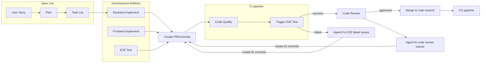

# Standard Of Process

## Workflow

```mermaid
graph LR
  subgraph SpecList["Spec List"]
    direction LR
    US[User Story] --> Plan[Plan] --> TaskList[Task List]
  end

  subgraph DevArt["Development Artifacts"]
    direction TB
    BE[Backend Implement]
    FE[Frontend Implement]
    E2EDev[E2E Test]
  end

  subgraph CI["CI pipeline"]
    direction TB
    CQ[Code Quality]
    TE[Trigger E2E Test]
  end

  PR[Create PR/Commits]
  FixE2E[Agent Fix E2E failed issues]
  CR[Code Review]
  FixCR[Agent fix code review issues]
  Merge[Merge to main branch]
  CD[CD pipeline]

  TaskList --> BE
  BE --> PR
  FE --> PR
  E2EDev --> PR

  PR --> CQ
  CQ --> TE
  TE -->|success| CR
  CR -->|approved| Merge
  Merge --> CD

  TE -->|failed| FixE2E
  FixE2E -->|create fix commits| PR

  CR --> FixCR
  FixCR -->|create fix commits| PR
```