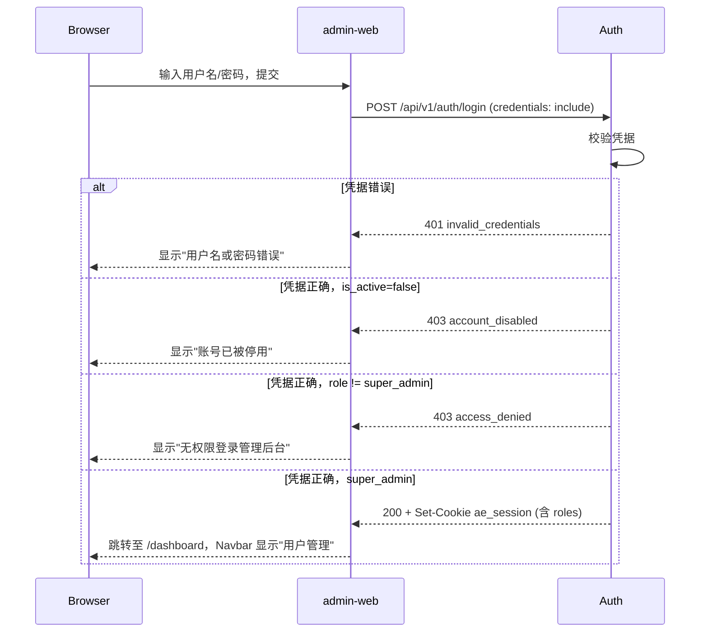
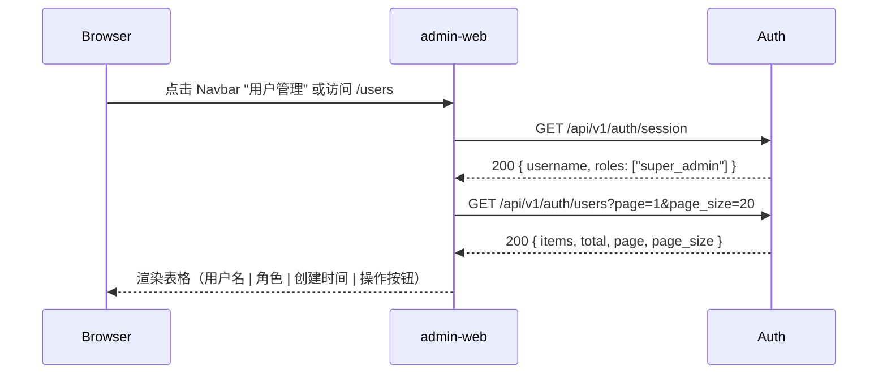
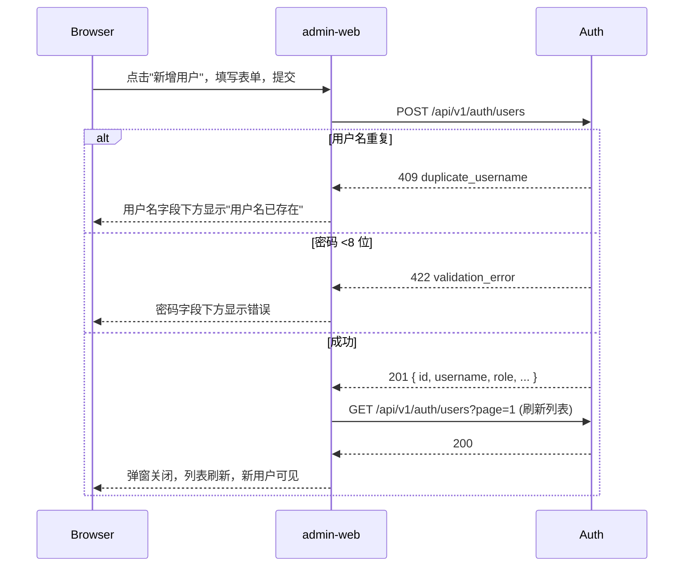
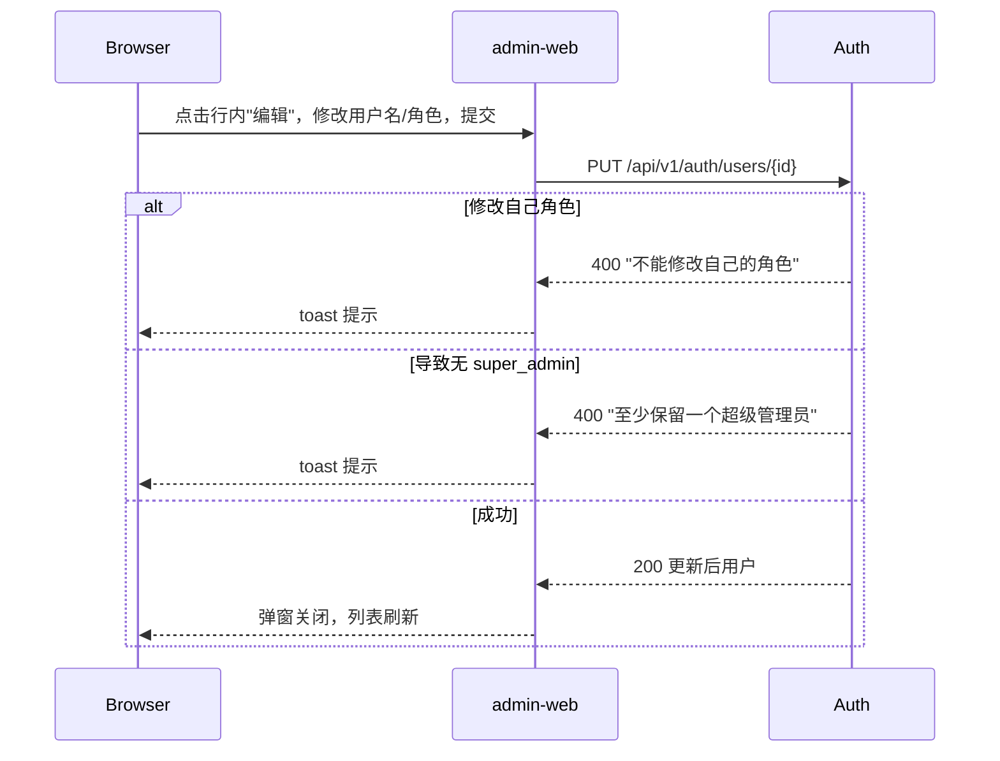
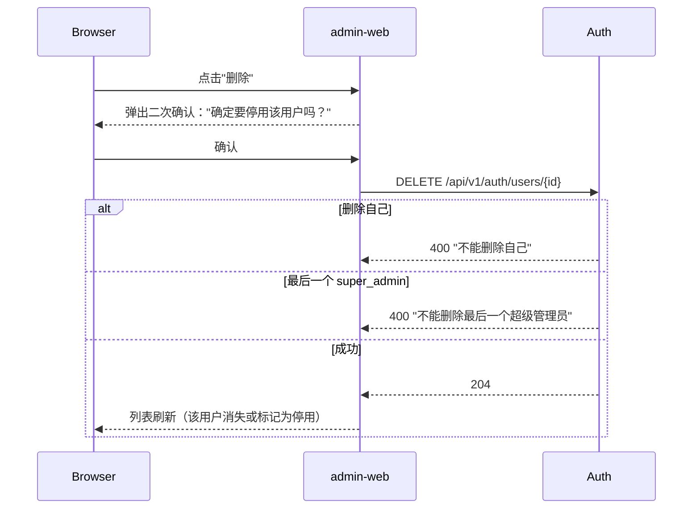
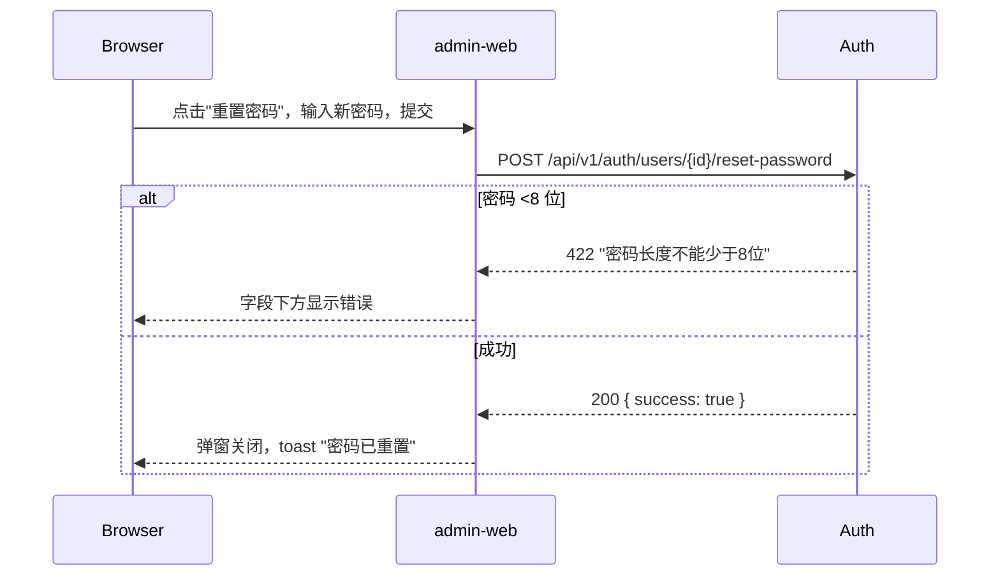

# Plan — 用户管理

- **Spec**：[spec.md](./spec.md)
- **Issue**：（待关联）

本文档为 **用户管理** 功能的**唯一**方案真源；实现须与此处及 OpenAPI/类型一致。若与 [spec.md](./spec.md) 冲突，以 **spec 验收（AC）** 为准并回写修正本 plan。

---

## 1. 需求理解与澄清

### 1.1 需求解读

本功能在现有 auth-service 的用户名/密码认证基础上，引入 **角色模型** 和 **Web 端用户管理能力**，将用户创建从 CLI 命令行迁移到 admin-web 图形界面。

核心脉络：

1. **角色分化**：将用户区分为 `super_admin`（可登录 admin-web 并管理用户）和 `user`（无后台权限），通过 `roles` 表 + `user_roles` junction 表（M:N）实现。
2. **登录权限收窄**：现有登录不区分角色，本需求增加角色检查——仅 `super_admin` 可登录 admin-web；`user` 角色登录返回 403。
3. **用户 CRUD**：超级管理员可在 admin-web 上查看、新增、编辑、软删除用户，以及重置任意用户密码。
4. **前端入口**：Navbar 按角色显隐"用户管理"链接；新增 `/users` 页面承载全部用户管理操作。

**利益相关者**：

| 干系人 | 关注点 |
|--------|--------|
| 超级管理员 | 通过 Web UI 完成用户账号全生命周期管理，无需登录服务器 |
| 普通用户 | 不受影响，继续通过业务入口使用系统 |
| 运维/DevOps | 数据库初始化自动 seed 管理员账号，后续管理由 Web 完成 |

**关键验收标准**（详见 [spec.md §3](./spec.md)）：仅 `super_admin` 可登录 admin-web；`user` 登录返回 403；用户列表支持分页/搜索；新增用户校验密码 ≥8 位 + 用户名唯一；编辑/删除有约束保护（不能删除自己/最后一个 super_admin）；删除为软删除（`is_active=false`）。

### 1.2 边界与范围确认

| 范围内 | 范围外（与 spec §7 对齐） |
|--------|--------------------------|
| roles 表 + users 表扩展 | 角色本身的可视化管理 UI |
| 登录角色校验 | 用户自助注册/修改信息 |
| 用户 CRUD API（含分页、搜索） | session 主动失效/踢下线 |
| admin-web 用户管理页面 | 操作日志/审计 |
| 数据库初始化 seed 角色 + 默认管理员 | 邮箱/手机等扩展字段 |

### 1.3 需澄清事项

阅读现有设计文档（[admin-web-auth.md](../../docs/admin-web-auth.md)、[Issue #3 plan](../3-用户可以登录-admin-web/plan.md)）后，以下信息已明确，无需额外澄清：

- **Session 机制**：复用现有 `ae_session` Cookie + 进程内 session store（单实例前提）。
- **密码哈希**：复用现有 Argon2id（`security.py`）。
- **前后端拓扑**：浏览器直连 Auth（CORS + `credentials: 'include'`）。
- **环境变量模式**：Auth 和 admin-web 各通过环境变量配置互联地址，与现有模式一致。

### 1.4 领域模型术语

本功能引入的核心领域概念：

| 术语 | 英文 | 定义 | 对应模型 |
|------|------|------|---------|
| **角色** | Role | 用户权限分组，控制 admin-web 访问与用户管理能力。一个 User 可拥有多个 Role | `roles` 表 |
| **超级管理员** | super_admin | 可登录 admin-web 并执行全部用户管理操作的角色 | `roles.name = "super_admin"` |
| **普通用户** | user | 无 admin-web 登录权限的角色（仅能通过 admin-web 之外的业务入口使用系统） | `roles.name = "user"` |
| **活跃状态** | is_active | 用户账号的启/停标记。`false` 等价于软删除，被停用用户无法登录 | `users.is_active` |
| **用户管理** | User Management | 超级管理员通过 admin-web 对用户账号进行增删改查及密码重置的操作集合 | `/users` 页面 + CRUD API |
| **用户角色关联** | UserRole | User 与 Role 的多对多关联（junction） | `user_roles` 表 |

已有领域概念（不重复定义）：**User**（用户名 + 密码哈希）、**Session**（`ae_session` Cookie）、**凭据**（username + password）。

---

## 2. 系统设计

### 2.1 架构延续性

本方案完全基于现有设计文档的架构决策进行增量设计：

| 现有决策（来源） | 本方案延续 |
|------------------|-----------|
| 浏览器直连 Auth，CORS + `credentials: 'include'`（[admin-web-auth.md](../../docs/admin-web-auth.md)） | 所有新增 API 复用同一 Cookie 认证通道 |
| Session 进程内存储、`ae_session` Cookie（[Issue #3 plan](../3-用户可以登录-admin-web/plan.md) §1.2 阶段 A） | login/session 修改保持 Cookie 名与属性不变 |
| Auth 单实例运维（[admin-web-auth.md](../../docs/admin-web-auth.md) §运维约束） | 不引入 Redis 或多实例需求 |
| FastAPI + SQLAlchemy + SQLite（[auth-service/AGENTS.md](../../auth-service/AGENTS.md)） | 无新增技术栈 |
| Next.js App Router + shadcn/ui（[admin-web/AGENTS.md](../../admin-web/AGENTS.md)） | 无新增前端依赖 |

### 2.2 领域层模型关系图

本方案仅在变更边界内引入一个新增实体（`Role`）、一个 junction 表（`user_roles`）并扩展 `User`：

```
┌──────────────────────────────────────────────────┐
│               变更边界（领域层）                    │
│                                                  │
│  ┌─────────────────────┐              ┌──────┐   │
│  │  User                │ *        *  │ Role │   │
│  │──────────────────────│────────────►│──────│   │
│  │ id (PK)              │             │ id   │   │
│  │ username              │  user_roles │ name │   │
│  │ pwd_hash              │ (junction)  │ desc │   │
│  │ is_active    ← 新增   │             └──────┘   │
│  │ created_at   ← 新增   │  单向：User → Role      │
│  │ roles[]      ← 新增   │                        │
│  └─────────────────────┘                         │
│                                                  │
│  不变领域概念：Session、凭据(credentials)、       │
│  密码哈希(password_hash)                          │
└──────────────────────────────────────────────────┘
```

**关系**：User 与 Role 为多对多（M:N），通过 `user_roles` junction 表关联。业务中仅维护 User → Role 单向关系（`user.roles`），Role 侧不建立反向引用。

### 2.3 各层变更总览

领域层之外，应用层、基础设施层和表示层的增量：

| 层 | 新增 | 修改 |
|----|------|------|
| **领域服务** | — | `session_store`：session 结构增加 `role` 字段 |
| **应用层** | `routers/users.py`（CRUD 端点）、`require_super_admin`（权限 Dependency） | `routers/auth.py`：login 增加 role/is_active 检查，session 返回 role |
| **基础设施层** | `seed_roles_and_admin()` | `models.py`：新增 Role、UserRole、扩展 User；`database.py`：seed 调用 |
| **表示层** | `/users` 页面、`UserTable`、`UserFormDialog`、`DeleteUserDialog`、`ResetPasswordDialog` | `Navbar`：新增"用户管理"入口（role 显隐）；`auth-api.ts`：新增 API 函数 |

### 2.4 组件边界与职责

| 组件 | 所属上下文 | 职责 | 对外接口 |
|------|-----------|------|---------|
| **admin-web 页面/组件** | 表示层 | 渲染 UI、收集输入、展示反馈 | 浏览器 DOM 事件 |
| **auth-api.ts** | 表示层（防腐层） | 封装 HTTP 调用，`credentials: 'include'`，类型转换 | `fetchUsers()`、`createUser()` 等函数 |
| **routers/auth.py** | 应用层 | 登录/登出/session 流程编排 | `POST /login`、`POST /logout`、`GET /session` |
| **routers/users.py** | 应用层 | 用户 CRUD 流程编排 + 权限校验 | `GET/POST/PUT/DELETE /users/*` |
| **schemas.py** | 应用层 | 请求/响应 DTO 定义与校验 | `UserCreate`、`UserOut`、`PaginatedUsers` 等 |
| **session_store.py** | 领域层 | 会话生命周期管理（进程内存储） | `create_session()`、`get()`、`delete()` |
| **security.py** | 领域层 | 密码哈希与校验 | `hash_password()`、`verify_password()` |
| **models.py** | 基础设施层 | ORM 实体映射（User、Role、UserRole） | SQLAlchemy Model 类 |
| **database.py** | 基础设施层 | DB 连接、建表、seed | `create_tables()`、`seed_roles_and_admin()`、`get_db()` |

### 2.5 设计原则

| 原则 | 在本方案的体现 |
|------|-------------|
| **最小改动** | 仅在 Auth 和 admin-web 既有模块上增量扩展，不新建服务、不重构目录结构 |
| **契约延续** | 复用现有 Session Cookie、CORS 策略、环境变量模式；新增 API 遵循已有路径前缀 `/api/v1/auth/` |
| **领域边界清晰** | 表示层不感知 ORM；应用层不直接操作 SQL；领域服务独立可测 |
| **安全深度** | 新增角色维度，每个管理端点双重校验（session 有效性 + role == super_admin） |
| **YAGNI** | 不在范围内建角色管理 UI、操作日志、多租户等；不预置未来才需要的抽象 |

---

## 3. API 设计

### 3.1 概览

所有新增端点基于现有路径前缀 `/api/v1/auth/`，沿用现有 Session Cookie 认证机制。管理端点均要求 `super_admin` 角色。

### 3.2 修改：`POST /api/v1/auth/login`

在现有凭据校验后增加两重检查：

1. `is_active == false` → **403** `{"error": "account_disabled", "message": "账号已被停用"}`
2. 用户不具有 `super_admin` 角色 → **403** `{"error": "access_denied", "message": "无权限登录管理后台"}`

**安全设计**：401（凭据失败）优先级高于 403。先校验用户名/密码，凭据正确后才检查角色和活跃状态。这避免了通过 403/401 差异枚举有效用户名。

### 3.3 修改：`GET /api/v1/auth/session`

响应体新增 `roles` 字段（用户拥有的所有角色列表）：

```json
{
  "username": "admin",
  "roles": ["super_admin"]
}
```

401 时响应形状不变（与现有契约一致）。

### 3.4 新增：`GET /api/v1/auth/users`

分页查询用户列表，支持按用户名模糊搜索。

- **Query Params**：`page`（默认 1）、`page_size`（默认 20，最大 50）、`search`（可选）
- **成功 200**：

```json
{
  "items": [
    {
      "id": 1,
      "username": "admin",
      "roles": ["super_admin"],
      "is_active": true,
      "created_at": "2026-05-01T00:00:00Z"
    }
  ],
  "total": 1,
  "page": 1,
  "page_size": 20
}
```

- **401**：未登录（与现有 `/session` 401 形状一致）
- **403**：非 `super_admin`

### 3.5 新增：`POST /api/v1/auth/users`

创建新用户。

- **请求体**：

```json
{
  "username": "string",
  "password": "string",
  "role_ids": [1]
}
```

- **校验**：`username` 必填且唯一；`password` 必填且 ≥8 位；`role_ids` 必填（至少一个），每个 id 对应存在的角色
- **成功 201**：

```json
{
  "id": 2,
  "username": "new_user",
  "roles": ["user"],
  "is_active": true,
  "created_at": "2026-05-10T00:00:00Z"
}
```

- **409**：`{"error": "duplicate_username", "message": "用户名已存在"}`
- **422**：`{"error": "validation_error", "message": "密码长度不能少于8位"}`

### 3.6 新增：`PUT /api/v1/auth/users/{user_id}`

修改用户信息（用户名、角色）。

- **请求体**：`{"username": "string", "role_ids": [2]}`
- **成功 200**：返回更新后的用户对象（同 §3.5 响应形状）
- **404**：用户不存在
- **400**：`{"error": "constraint_violation", "message": "不能修改自己的角色"}` 或 `"至少保留一个超级管理员"`
- **401 / 403**：同 §3.4

### 3.7 新增：`DELETE /api/v1/auth/users/{user_id}`

软删除（设置 `is_active = false`）。

- **成功 204**：无响应体
- **404**：用户不存在
- **400**：`{"error": "constraint_violation", "message": "不能删除自己"}` 或 `"不能删除最后一个超级管理员"`
- **401 / 403**：同 §3.4

### 3.8 新增：`POST /api/v1/auth/users/{user_id}/reset-password`

重置用户密码。

- **请求体**：`{"password": "string"}`（≥8 位）
- **成功 200**：`{"success": true}`
- **404**：用户不存在
- **422**：校验失败
- **401 / 403**：同 §3.4

### 3.9 权限矩阵汇总

| 端点 | 未登录 | `user` 角色 | `super_admin` 角色 |
|------|--------|-------------|--------------------|
| `POST /login` | 200/401 | 401→403 | 200 |
| `POST /logout` | 204 | 204 | 204 |
| `GET /session` | 401 | 200（含 role） | 200（含 role） |
| `GET /users` | 401 | 403 | 200 |
| `POST /users` | 401 | 403 | 201 |
| `PUT /users/{id}` | 401 | 403 | 200 |
| `DELETE /users/{id}` | 401 | 403 | 204 |
| `POST /users/{id}/reset-password` | 401 | 403 | 200 |

---

## 4. 端到端的交互设计

### 4.1 登录（含角色校验）



### 4.2 用户列表查看



### 4.3 新增用户



### 4.4 编辑用户



### 4.5 删除用户（软删除）



### 4.6 重置密码



### 4.7 数据流与集成点总结

所有业务场景遵循统一的数据流模式：Browser → admin-web → Auth，跨组件集成点如下：

| 集成点 | 方向 | 协议 | 说明 |
|--------|------|------|------|
| admin-web → Auth（所有 API） | 浏览器直连 | HTTPS + Cookie | 携带 `ae_session`，`credentials: 'include'`，基址 `NEXT_PUBLIC_AUTH_API_BASE_URL` |
| router → session_store | 进程内 | Python 函数调用 | 同步，无网络边界 |
| router → security | 进程内 | Python 函数调用 | `hash_password()` 用于创建/重置密码；`verify_password()` 用于登录 |
| router → database | 进程内 | SQLAlchemy Session | 通过 FastAPI `Depends(get_db)` 注入 |
| database → SQLite | 本地文件 | SQL | 无网络边界 |

**数据变更传播**：写操作（POST/PUT/DELETE）通过 SQLAlchemy flush 同步写入 SQLite，后续读操作即时可见最新数据。Session 数据（含 `role`）存于进程内存，与 SQLite 独立——修改 DB 中 `is_active` 或 `role` 不影响已有 session，下次登录时重新加载生效。

---

## 5. 技术选型

无技术栈变更。本功能是现有 auth-service 和 admin-web 的自然功能扩展，所有需求均可通过现有技术栈满足：

| 需求 | 使用的现有技术 | 依据 |
|------|--------------|------|
| 角色模型（roles 表 + FK） | SQLAlchemy 2.x ORM | [auth-service/AGENTS.md](../../auth-service/AGENTS.md) |
| 用户管理 CRUD API | FastAPI + Pydantic 校验 | 同上 |
| 权限校验 | FastAPI Dependency 注入 | 同上 |
| 密码哈希（创建/重置） | argon2-cffi（`security.py`） | [admin-web-auth.md](../../docs/admin-web-auth.md) §5 |
| 用户管理页面 | Next.js 16 + shadcn/ui Table/Dialog | [admin-web/AGENTS.md](../../admin-web/AGENTS.md) |
| 测试 | pytest + Vitest + Playwright | 各子项目 AGENTS.md |

**不引入新技术**：角色模型为 ORM 基本操作，无需 RBAC 框架；前端表格/表单为 shadcn/ui 内置组件即可满足。团队对现有技术栈已高度熟悉，无需额外培训。

| 技术 | 团队熟悉度 | 备注 |
|------|----------|------|
| FastAPI + SQLAlchemy | 高 | 已有生产级 login/session 实现 |
| Next.js App Router + shadcn/ui | 高 | 已有登录页、Navbar、dashboard 实现 |
| SQLite | 高 | 零运维，开发/测试阶段无需外部依赖 |
| pytest + Vitest | 高 | 现有测试套件已有模板可参考 |

---

## 6. 核心组件设计

### 6.1 Auth 服务端

#### 6.1.1 模块接口契约（基于现有模块扩展）

每个变更模块的接口契约，明确"现有接口 → 扩展后接口"：

**`session_store.py`** — 扩展 session 数据结构（现有接口：session 为 `{user_id, username}`）

| 方法 | 现有签名 | 变更 |
|------|---------|------|
| `create_session()` | `(user_id: int, username: str) -> str` | 增加 `roles: list[str]` 参数：`(user_id, username, roles) -> str` |
| `get()` | `(session_id: str) -> dict \| None` | 返回值增加 `roles` 键（字符串数组） |
| `delete()` | `(session_id: str) -> None` | 不变 |

**`security.py`** — 不变量

| 方法 | 签名 | 调用方 |
|------|------|--------|
| `hash_password()` | `(password: str) -> str` | `POST /users`、`POST /users/{id}/reset-password`、CLI、seed |
| `verify_password()` | `(password: str, hash: str) -> bool` | `POST /login` |

**`models.py`** — 新增 UserRole junction + User 模型扩展

| 变更类型 | 内容 |
|----------|------|
| **新增表** | `user_roles`（`user_id` FK → users.id, `role_id` FK → roles.id，联合主键） |
| **User 新增属性** | `is_active` (bool), `created_at` (datetime) |
| **User 新增 Relationship** | `roles: Relationship(Role)`, `secondary="user_roles"`, `lazy="joined"` |

**`database.py`** — 新增 seed 入口

| 函数 | 调用时机 | 幂等性 |
|------|---------|--------|
| `seed_roles_and_admin()`（新增） | `create_tables()` 之后 | 检查 `roles`/`users` 是否为空，已存在则跳过 |

**`routers/auth.py`** — login/session 修改 + 抽取公共依赖

| 端点 | 变更 |
|------|------|
| `POST /login` | 凭据校验后增加：`if not user.is_active → 403`；`if "super_admin" not in user.roles → 403`；创建 session 时传入 `[r.name for r in user.roles]` |
| `GET /session` | 响应体增加 `roles` 字段（从 session 读取） |

**`routers/users.py`**（新文件）— 依赖关系

```
require_super_admin (Depends)
       │
       ├── session_store.get(cookie) → 校验 session 有效性
       └── "super_admin" in session["roles"] → 校验角色
       │
       ▼
   db: Session (Depends get_db)
       │
       ▼
   User + UserRole + Role ORM 查询
```

#### 6.1.2 文件变更清单

| 文件 | 操作 | 说明 |
|------|------|------|
| `app/models.py` | 修改 | 新增 `Role`、`UserRole` 模型；`User` 模型新增 `is_active`、`created_at`、`roles` relationship（M:N） |
| `app/schemas.py` | 修改 | 新增用户管理相关 Pydantic 模型（`UserOut`、`UserCreate`、`UserUpdate`、`PaginatedUsers`、`ResetPasswordRequest` 等） |
| `app/database.py` | 修改 | 新增 `seed_roles_and_admin()` 函数，在 `create_tables()` 后调用 |
| `app/security.py` | 不变 | 复用 `hash_password` / `verify_password` |
| `app/session_store.py` | 修改 | session 数据结构新增 `roles` 字段；`create_session` 参数新增 `roles` |
| `app/routers/auth.py` | 修改 | login 增加 is_active + role 检查；session 端点增加 role 返回；抽取 `require_super_admin` 依赖 |
| `app/routers/users.py` | **新增** | 用户 CRUD 路由（§3.4–§3.8） |
| `app/main.py` | 修改 | 注册 `users_router` |
| `app/cli.py` | 修改 | `create-user` 命令增加 `--roles` 参数（默认 `super_admin`） |

#### 6.1.3 Role 与 UserRole 模型

```python
class Role(Base):
    __tablename__ = "roles"
    id = Column(Integer, primary_key=True, autoincrement=True)
    name = Column(String(50), unique=True, nullable=False)
    description = Column(String(255), nullable=True)

class UserRole(Base):
    __tablename__ = "user_roles"
    user_id = Column(Integer, ForeignKey("users.id"), primary_key=True)
    role_id = Column(Integer, ForeignKey("roles.id"), primary_key=True)
```

#### 6.1.4 User 模型增量

在现有 `id`、`username`、`password_hash` 基础上：

```python
is_active = Column(Boolean, nullable=False, default=True)
created_at = Column(DateTime, nullable=False, default=func.now())
roles = relationship("Role", secondary="user_roles", lazy="joined")
```

#### 6.1.5 权限校验依赖（FastAPI Dependency）

```python
async def require_super_admin(request: Request, db: Session = Depends(get_db)):
    session_id = request.cookies.get("ae_session")
    if not session_id:
        raise HTTPException(status_code=401, detail={"error": "unauthenticated", "message": "未登录"})
    session = session_store.get(session_id)
    if not session:
        raise HTTPException(status_code=401, detail={"error": "unauthenticated", "message": "会话已失效"})
    if "super_admin" not in session.get("roles", []):
        raise HTTPException(status_code=403, detail={"error": "access_denied", "message": "无权限"})
    return session
```

#### 6.1.6 约束校验函数（供 users router 复用）

| 函数 | 说明 |
|------|------|
| `validate_can_modify_roles(db, current_user_id, target_user_id, new_role_ids)` | 检查是否修改自己的角色；检查修改后是否导致无 super_admin |
| `validate_can_delete(db, current_user_id, target_user_id)` | 检查是否删除自己；检查是否最后一个 super_admin |

#### 6.1.7 Seed 逻辑

在 `database.py` 中，`create_tables()` 之后执行 `seed_roles_and_admin()`：

1. 若 `roles` 表为空 → 插入 `super_admin` 和 `user`
2. 若 `users` 表为空 → 使用 `ADMIN_DEFAULT_USERNAME`（默认 `admin`）/ `ADMIN_DEFAULT_PASSWORD`（默认 `Admin123!`）创建默认管理员，并在 `user_roles` 中关联 `super_admin` 角色

### 6.2 admin-web 前端

#### 6.2.1 文件变更清单

| 文件 | 操作 | 说明 |
|------|------|------|
| `src/lib/auth-api.ts` | 修改 | 新增用户管理 API 调用函数；`fetchSession` 增加 `role` 返回类型 |
| `src/components/Navbar.tsx` | 修改 | 新增"用户管理"链接，`session.roles?.includes('super_admin')` 时渲染 |
| `src/app/users/page.tsx` | **新增** | 用户管理页面（服务端组件壳 + 客户端内容） |
| `src/components/UserTable.tsx` | **新增** | 用户列表表格（shadcn/ui Table） |
| `src/components/UserFormDialog.tsx` | **新增** | 新增/编辑用户弹窗（shadcn/ui Dialog + Form） |
| `src/components/DeleteUserDialog.tsx` | **新增** | 删除确认弹窗（shadcn/ui AlertDialog） |
| `src/components/ResetPasswordDialog.tsx` | **新增** | 重置密码弹窗 |

#### 6.2.2 路由与权限

- `/users` — 客户端组件页面
- 挂载时调用 `GET /api/v1/auth/session`：
  - 未登录 → `router.replace('/login')`
  - roles 不含 `super_admin` → `router.replace('/dashboard')`
  - roles 含 `super_admin` → 加载用户列表

#### 6.2.3 API 调用层（`auth-api.ts` 增量）

```typescript
// 类型定义
interface User {
  id: number;
  username: string;
  roles: string[];
  is_active: boolean;
  created_at: string;
}

interface PaginatedUsers {
  items: User[];
  total: number;
  page: number;
  page_size: number;
}

// 函数签名
fetchUsers(params: { page?: number; page_size?: number; search?: string }): Promise<PaginatedUsers>
createUser(data: { username: string; password: string; role_ids: number[] }): Promise<User>
updateUser(userId: number, data: { username: string; role_ids: number[] }): Promise<User>
deleteUser(userId: number): Promise<void>
resetPassword(userId: number, password: string): Promise<void>
// 修改：fetchSession 返回 { username: string; roles: string[] }
```

所有函数复用现有 `fetch` 封装（`credentials: 'include'`），基址来自 `NEXT_PUBLIC_AUTH_API_BASE_URL`。

#### 6.2.4 组件树

```
app/users/page.tsx                     ← "use client"
├── <h1>用户管理</h1>
├── 工具栏
│   ├── <SearchInput />                ← 防抖搜索，触发列表刷新
│   └── <Button>新增用户</Button>       ← 打开 UserFormDialog (mode="create")
├── <UserTable>
│   └── 每行：用户名 | 角色名 | 创建时间 | [编辑] [重置密码] [删除]
│       ├── [编辑]       → 打开 UserFormDialog (mode="edit", userId)
│       ├── [重置密码]   → 打开 ResetPasswordDialog
│       └── [删除]       → 打开 DeleteUserDialog
└── <Pagination />                     ← page/page_size 受控，切换时刷新列表

<UserFormDialog>                       ← mode: "create" | "edit"
├── <Input label="用户名" />            ← 必填
├── <Input label="密码" type="password" /> ← 仅 mode="create" 时显示，必填
├── <Select label="角色" />             ← 从 roles 列表渲染选项
└── 保存 / 取消

<DeleteUserDialog>                     ← AlertDialog
└── 确认文案 + 取消/确认

<ResetPasswordDialog>                  ← Dialog
├── <Input label="新密码" type="password" /> ← 最短 8 位
└── 确认 / 取消
```

#### 6.2.5 Navbar 变更

```tsx
// 从 session 读取 roles，条件渲染
{session?.roles?.includes('super_admin') && (
  <Link href="/users">用户管理</Link>
)}
```

#### 6.2.6 错误处理策略

| 错误 | 呈现方式 |
|------|---------|
| 409 用户名重复 | 用户名字段下方 inline error |
| 422 校验失败 | 对应字段下方 inline error |
| 400 约束违反 | toast（如"不能删除自己"） |
| 401 未登录 | `router.replace('/login')` |
| 403 无权限 | `router.replace('/dashboard')` |
| 网络/5xx | toast "操作失败，请重试" |

---

## 7. 数据架构

### 7.1 实体关系

```
┌──────────┐     ┌──────────────┐     ┌──────────┐
│  users   │ 1  *│ user_roles   │*  1 │  roles   │
│──────────│────►│──────────────│────►│──────────│
│ id (PK)  │     │ user_id (FK) │     │ id (PK)  │
│ username │     │ role_id (FK) │     │ name (U) │
│ pwd_hash │     │ (联合主键)    │     │ desc     │
│ is_active│     └──────────────┘     └──────────┘
│ created  │      单向：User → Role
└──────────┘
```

### 7.2 新增表：`roles`

| 列 | 类型 | 约束 | 说明 |
|----|------|------|------|
| `id` | INTEGER | PK, AUTOINCREMENT | |
| `name` | VARCHAR(50) | UNIQUE, NOT NULL | `super_admin` / `user` |
| `description` | VARCHAR(255) | NULLABLE | 中文描述 |

### 7.3 新增表：`user_roles`（junction）

| 列 | 类型 | 约束 | 说明 |
|----|------|------|------|
| `user_id` | INTEGER | PK, FK → users.id ON DELETE CASCADE | |
| `role_id` | INTEGER | PK, FK → roles.id | |

联合主键 `(user_id, role_id)` 确保同一用户不会重复关联同一角色。

### 7.4 变更表：`users`

在现有 `id`、`username`、`password_hash` 基础上新增（**移除** `role_id` 外键，改为 M:N）：

| 列 | 类型 | 约束 | 说明 |
|----|------|------|------|
| `is_active` | BOOLEAN | NOT NULL, DEFAULT TRUE | `false` 表示软删除/停用 |
| `created_at` | DATETIME | NOT NULL, server_default=NOW | 创建时间 |

### 7.5 Seed 数据

数据库首次初始化时自动写入：

| 表 | 数据 |
|----|------|
| `roles` | `{name: "super_admin", description: "超级管理员"}`、`{name: "user", description: "普通用户"}` |
| `users` | `{username: "admin", password_hash: "<Argon2id>", is_active: true}` |
| `user_roles` | `{user_id: admin的id, role_id: super_admin的id}` |

默认管理员凭据通过环境变量 `ADMIN_DEFAULT_USERNAME` / `ADMIN_DEFAULT_PASSWORD` 配置，未设置时使用内置默认值。

### 7.6 兼容性

- **新数据库**：`create_tables()` → `seed_roles_and_admin()` 自动处理。
- **已有数据库**：需提供迁移脚本（ALTER TABLE 新增列 + 插入 roles + 将现有用户设定为 super_admin）。若开发阶段数据库无重要数据，可直接删除重建。

---

## 8. 安全设计

| 层面 | 措施 | 依据 |
|------|------|------|
| **密码存储** | Argon2id 哈希，复用 `app/security.py` | 与现有 [admin-web-auth.md](../../docs/admin-web-auth.md) 一致 |
| **密码传输** | 仅在请求体中传输，禁止出现在 URL 或日志 | 与现有登录端点安全约束一致 |
| **Session** | HttpOnly Cookie `ae_session`，SameSite=Lax，Path=/ | 复用现有 Session 机制（[Issue #3 plan](../3-用户可以登录-admin-web/plan.md) §3.1） |
| **CORS** | `Access-Control-Allow-Origin` 固定为 admin-web 部署 origin，`Allow-Credentials: true` | 与现有 CORS 配置一致 |
| **权限** | 每个管理端点通过 FastAPI Dependency 校验 session 有效性 + `role == super_admin` | 双重校验，缺一不可 |
| **防用户枚举** | 登录时先校验凭据（401），凭据正确后才检查角色/活跃状态（403） | 避免通过 403/401 差异探测有效用户名 |
| **CSRF** | SameSite=Lax + 所有管理请求为 JSON（非 form 提交） | 基础防护 |
| **敏感操作确认** | 删除用户需二次弹窗确认；修改自己角色被阻止 | 与 spec §3.6 / §3.5 AC 一致 |
| **日志安全** | 禁止日志输出密码明文或原始哈希 | 与 [auth-service/AGENTS.md](../../auth-service/AGENTS.md) 安全章节一致 |

---

## 9. 部署架构（无架构变更）

部署拓扑、运维约束、CI/CD 流水线均与 [admin-web-auth.md](../../docs/admin-web-auth.md) 一致，无变更。

**唯一新增**：Auth 服务新增两个环境变量用于 seed 默认管理员：

| 变量 | 默认值 | 说明 |
|------|--------|------|
| `ADMIN_DEFAULT_USERNAME` | `admin` | seed 默认管理员用户名 |
| `ADMIN_DEFAULT_PASSWORD` | `Admin123!` | seed 默认管理员密码（仅在首次建表时使用） |

现有门禁（lint、typecheck、test、覆盖率 ≥90%）覆盖新增代码，无需新增 CI 步骤。

---

## 10. 实施路线图

### 阶段 1：Auth 数据层（基础）

| # | 任务 | 依赖 |
|---|------|------|
| 1 | 新增 `Role` 模型 | — |
| 2 | `User` 模型增加 `is_active`、`created_at`、`roles` relationship（M:N）；新增 `UserRole` junction 模型 | 1 |
| 3 | 实现 `seed_roles_and_admin()` + 环境变量读取 | 1, 2 |
| 4 | 更新 CLI `create-user` 命令（增加 `--roles` 参数，默认 `super_admin`） | 2 |

### 阶段 2：Auth API 层

| # | 任务 | 依赖 |
|---|------|------|
| 5 | `session_store` 扩展：session 数据结构增加 `role` | 2 |
| 6 | 修改 `POST /login`：增加 is_active + role 检查 | 5 |
| 7 | 修改 `GET /session`：响应体增加 `role` | 5 |
| 8 | 实现 `require_super_admin` Dependency | 5 |
| 9 | 新增 `GET /api/v1/auth/users`（分页 + 搜索） | 8 |
| 10 | 新增 `POST /api/v1/auth/users`（含唯一性 + 密码校验） | 8 |
| 11 | 新增 `PUT /api/v1/auth/users/{id}`（含约束校验） | 8 |
| 12 | 新增 `DELETE /api/v1/auth/users/{id}`（含约束校验） | 8 |
| 13 | 新增 `POST /api/v1/auth/users/{id}/reset-password` | 8 |
| 14 | 注册 users router 到 `main.py` | 9–13 |

### 阶段 3：admin-web 前端

| # | 任务 | 依赖 |
|---|------|------|
| 15 | `auth-api.ts` 新增用户管理 API 函数 + 类型定义 | 9–13（契约已定，可并行） |
| 16 | Navbar 增加"用户管理"链接（role 条件显隐） | 7（契约已定，可并行） |
| 17 | 新增 `UserTable` 组件 | 15 |
| 18 | 新增 `UserFormDialog` 组件（创建/编辑复用） | 15 |
| 19 | 新增 `DeleteUserDialog` 组件 | 15 |
| 20 | 新增 `ResetPasswordDialog` 组件 | 15 |
| 21 | 新增 `/users` 页面（组装组件 + 权限守卫） | 17–20 |

### 阶段 4：测试与验收

| # | 任务 | 依赖 |
|---|------|------|
| 22 | Auth 单元测试：模型、seed、login 变更、session 变更 | 7, 8 |
| 23 | Auth 单元测试：users CRUD 所有端点 + 边界场景 | 9–13 |
| 24 | admin-web 单元测试：auth-api 函数 + Navbar + 关键组件 | 15–20 |
| 25 | 覆盖率验证（Auth + admin-web 均 ≥90%） | 22–24 |
| 26 | E2E 测试（可选）：完整用户管理流程 | 21 |

**并行策略**：阶段 1→2 串行；阶段 3 可与阶段 2 并行（基于本 plan 的 API 契约 mock）；阶段 4 贯穿全程但主要集中在各阶段完成后。

### 里程碑与检查点

| 里程碑 | 完成标志 | 验证方式 |
|--------|---------|---------|
| **M1：数据层就绪** | Role/User 模型可建表，seed 成功，CLI 可创建带角色的用户 | `uv run pytest tests/ -k "model or seed or cli"` |
| **M2：API 层就绪** | login 含角色校验，session 返回 role，6 个 users 端点全部可用 | `uv run pytest tests/ -k "auth or users"`；手工 `curl` 验证权限矩阵 |
| **M3：前端就绪** | `/users` 页面可完成新增→编辑→重置密码→删除全流程 | `pnpm dev` + 浏览器手工验证；`pnpm test` |
| **M4：质量门禁通过** | lint、typecheck、test 零失败，覆盖率 ≥90% | `uv run ruff check && uv run pytest --cov`；`pnpm lint && pnpm tsc --noEmit && pnpm test` |
| **M5（可选）：E2E 验收** | Playwright 关键流程通过 | `pnpm test`（e2e/） |

---

## 11. 风险与考量

### 11.1 技术风险

| 风险 | 影响 | 缓解措施 |
|------|------|---------|
| **现有 DB 无 roles 表** | 已有数据需迁移，否则启动失败 | seed 逻辑在 `create_tables` 后处理；开发阶段可删除重建；提供 ALTER TABLE 迁移说明 |
| **软删除后 session 仍有效** | 被停用用户在 session TTL 内仍可访问 | 当前不强制失效（spec §7 明确 scope 外）；后续可在 `require_super_admin` 依赖中增加 is_active 检查 |
| **进程重启丢 session + seed 逻辑** | Auth 重启后所有用户需重新登录 | 与现有运维约束一致（[admin-web-auth.md](../../docs/admin-web-auth.md)）；seed 逻辑每次启动执行但仅首次写入（幂等） |
| **seed 默认密码硬编码** | 若未改默认密码，存在安全风险 | 通过环境变量 `ADMIN_DEFAULT_PASSWORD` 强制配置；首次登录后建议立即修改 |

### 11.2 设计权衡

| 决策 | 选择 | 权衡 |
|------|------|------|
| 角色不由 UI 管理 | 与 spec §7 范围外一致 | 简单，但未来扩展需要新增角色管理 CRUD |
| 角色用 M:N（`user_roles` junction）而非 `users.role_id` FK | 关系型模型 | 一个用户可拥有多个角色，后续灵活扩展；查询时需 JOIN `user_roles` |
| 前端调用真实 roles 列表 vs 硬编码下拉选项 | 直接查询 DB 中 roles 表（或前端硬编码 `super_admin` / `user`） | MVP 可前端硬编码两个角色选项（与 spec "角色不由 Web UI 管理" 一致）；未来若角色增多可新增 `GET /api/v1/auth/roles` 端点 |
| 软删除后列表是否显示已停用用户 | 建议列表默认不显示 `is_active=false` 的用户 | 简化 UI；若后续需要"已停用用户"视图可增加筛选 |

### 11.3 spec 中已识别的开放问题（无阻塞）

spec §6 列出的开放问题（session 强制失效、操作日志、用户扩展字段）均不在本方案范围内，与 spec §7 "范围外"一致。这些问题的答案不影响当前方案设计，可在后续迭代中独立决策。
