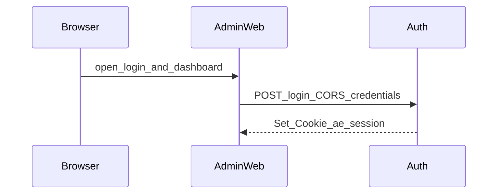
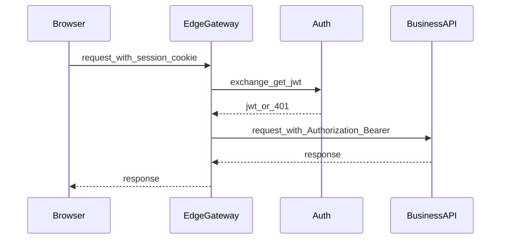

# Plan — 用户可以登录 admin-web

- **Spec**：[spec.md](./spec.md)
- **Issue**：https://github.com/xiayy860612/agentic-engineer/issues/3
- **Tasks**：[tasks.md](./tasks.md)

本文档为 **Issue #3** 的**唯一**会话与令牌方案真源；实现须与此处及 OpenAPI/类型一致。若与 [spec.md](./spec.md) 冲突，以 **spec 验收（AC）** 为准并回写修正本 plan。

---

## 0. 本 Story 范围（阶段 0）

| 项 | 说明 |
|----|------|
| **交付** | **admin-web** + **Auth**；浏览器经 admin-web **直连** Auth（登录/登出、Session Cookie、CORS）；**AC1–AC4** 在此拓扑下验收。 |
| **部署（与 [tasks.md](./tasks.md) 对齐）** | **Auth 单实例**；Session **仅进程内**。**不包含** Session 迁移 **Redis**、多实例水平扩展（阶段 B 叙述见 §1.2，**不在本 Story tasks**）。 |
| **不包含** | 承担 **换票 + Bearer 注入** 的边缘网关、对内换票 API、面向业务服务的 JWT 验签链路等 **阶段 1** 内容，统一见 **§9 Out of scope**。 |

**说明**：若以 **nginx** 仅做 TLS 终止或反代到 Auth、**未**执行换票与 Bearer 注入，仍属本 Story 范围（阶段 0）。

---

## 1. 架构与数据流（单选方案）

### 1.1 组件（范围内）

| 组件 | 职责 |
|------|------|
| **admin-web**（Next.js） | 登录页、受保护占位路由；浏览器 **直连 Auth 对外 API**（中间可有 **nginx 纯反代**，见 §0）；**不**在浏览器内长期持有用于访问业务 API 的 Bearer JWT。 |
| **Auth**（FastAPI） | 用户名/密码校验；**Session 真源**（见 §1.2）；登录/登出对 Cookie 的 `Set-Cookie` / 失效；CORS。**换票 / JWT 签发**见 §9，本 Story 可不实现。 |
| **Redis** | **后续（Session 外置）**：由 **Auth** 用作 Session 存储，支持多实例共享；见 §1.2 阶段 B。 |

**边缘网关、业务服务**：见 §9。

### 1.2 Session 真源（与 spec「单选」对齐）

- **当前（阶段 A）**：Session 数据存于 **Auth 服务进程内**（opaque session id ↔ 进程内会话表，如内存 dict 或等价实现）；**不要求** Redis，**不要求** Auth 多实例间共享 session。
- **后续（阶段 B，迁移）**：将 Session 外置到 **Auth 侧 Redis**（opaque session id ↔ Redis 记录），以支持 **Auth 水平扩展与多实例共享**；迁移须保持 Cookie 名与对外登录契约不变（或经显式版本化）；与换票契约的关系见 §9。
- **阶段 A 约束与风险**：本 Story 以 **单实例 Auth** 为验收前提。若将来在未迁移 Redis 前横向扩容 Auth 且无会话外置或 sticky，将出现 **session 不可见/频繁掉线**——须在运维上禁止该拓扑，或优先完成阶段 B（**不在当前 Story scope**）。
- 浏览器通过 **`Set-Cookie`** 持有 **opaque session id**（见 §3 Cookie 名与属性）。
- **AC1「已认证」可观测状态**：浏览器对 Auth 域（或 `plan` 规定的父域 Cookie 范围）持有 **有效 Session Cookie**，且可进入 **`/dashboard` 占位**（见 §5）。**不要求**换票或边缘网关。

### 1.3 本 Story 与换票 / JWT 的边界

本 Story（阶段 0）**不验收**边缘网关换票、不向浏览器下发业务用 Bearer、不要求业务服务验签。若团队在 Auth 内 **预置** §9 所述 JWT 与换票接口，可不挂载公网路由，**不参与** AC1 断言；**阶段 1 工作项不得写入本 Story 的 [tasks.md](./tasks.md)**，须在其它 backlog/里程碑中跟踪并与 **§9** 对齐。

### 1.4 换票接口（范围内说明）

- **本 Story**：换票接口 **可不实现**；若实现，**不得**对公网开放。
- **阶段 1** 的信任模型与调用方约束见 **§9.4**。

### 1.5 顺序图（范围内）



**登录**：浏览器（经 admin-web）→ Auth `POST /api/v1/auth/login`（§2）；成功则 `Set-Cookie` 建立 session。

---

## 2. 对外 HTTP 契约 — 登录（浏览器 / admin-web → Auth）

**基址**：由部署决定；admin-web 通过环境变量读取 **Auth 对外 origin**（实现时建议 `NEXT_PUBLIC_AUTH_API_BASE_URL`，仅 scheme+host+port，无尾斜杠）。

### 2.1 登录

- **路径**：`POST /api/v1/auth/login`
- **请求体**（`application/json`）：

```json
{
  "username": "string",
  "password": "string"
}
```

- **成功**：HTTP **200**
  - **响应体**（`application/json`）：

```json
{
  "success": true
}
```

  - **不得**在响应体中返回 JWT 或长期 refresh token（本方案浏览器侧会话以 Cookie 为准）。
  - **响应头**：`Set-Cookie` 设置 session（§3）。

- **泛化凭据失败**（满足 **AC2、AC3**）：HTTP **401**（单一状态码，两场景共用）
  - **响应体**（`application/json`），字段集合与取值在未知用户与错误密码场景下 **逐字一致**：

```json
{
  "error": "invalid_credentials",
  "message": "用户名或密码错误"
}
```

  - **`error` 取值**：固定为 `invalid_credentials`；**禁止**使用 `user_not_found`、`wrong_password` 等可区分子类的 machine-readable 值。
  - **`message`**：与 admin-web 展示文案一致（可后续抽到文案表，但须与 spec 对齐）。

- **其它服务端错误**：HTTP **5xx**；响应体形状可与登录失败不同，但 **401 + 上述 JSON** 仅用于「泛化凭据失败」。

### 2.2 登出（建议与登录同迭代实现，便于验收登出清缓存）

- **路径**：`POST /api/v1/auth/logout`
- **请求**：须携带 **Session Cookie**（§3）。
- **成功**：HTTP **204** 或 **200** + `Set-Cookie` 清除 session；删除进程内 session 记录；**迁移 Redis 后**删除 Redis 中对应记录。若已按 §9 启用 **JWT 签发缓存**，登出时须一并清除（本 Story 无 JWT 路径时可为 no-op）。

---

## 3. Cookie 与 CORS（admin-web 与 Auth 子域场景）

### 3.1 Session Cookie（由 Auth 在登录成功时设置）

| 属性 | 值 |
|------|-----|
| **Name** | `ae_session` |
| **HttpOnly** | `true` |
| **Secure** | `true`（生产）；本地 `http://localhost` 按浏览器规则可放宽，由实现文档说明 |
| **Path** | `/` |
| **SameSite** | `Lax`（默认）；若嵌入场景需 `None` 则须 `Secure` 且评估 CSRF |
| **Domain** | 与运维约定一致：同 eTLD+1 子域共享时使用 **父域**（如 `.example.com`），须在部署文档写死 |

### 3.2 CORS（Auth 对外登录 API）

- **`Access-Control-Allow-Origin`**：必须为 **admin-web 部署 origin 的完整字符串**（禁止 `*`）。
- **`Access-Control-Allow-Credentials`**：`true`。
- **允许方法**：至少 `POST`、`OPTIONS`；允许头：`Content-Type`、`Cookie`（若跨域读 cookie 需按规范）。
- admin-web 使用 `fetch(..., { credentials: 'include' })` 调用登录（及若跨域调用登出）。

---

## 4. admin-web 行为摘要

| 项 | 约定 |
|----|------|
| **登录 API** | `POST {AUTH_BASE}/api/v1/auth/login`，JSON body，`credentials: 'include'` |
| **受保护占位路由** | `/dashboard`（占位页）；未持有有效 session 时：若仅前端判断，则重定向至 `/login`；最终以 middleware 实现为准 |
| **未登录访问受保护路由** | **302** 至 `/login`（或 **307**，择一写死） |
| **错误展示** | 登录失败展示 **`message` 固定为「用户名或密码错误」**（与 401 响应体一致） |

---

## 5. 密码、密钥与环境变量（真源摘要）

- **密码存储**：**Argon2id**（首选）或 **bcrypt**（成本因子按团队基线）；禁止明文与可逆加密；禁止日志输出密码与原始 JWT。
- **Session**：进程内存储时须约定 session id 熵、TTL（若有）、进程重启则会话失效等行为；**迁移 Redis 后**增加 Redis URL、连接池与（若使用）cookie 签名密钥（实现文档）。
- **JWT 签名**（若实施 §9）：独立 `JWT_PRIVATE_KEY` / 或对称密钥；**禁止**提交仓库（见根目录 [AGENTS.md](../../AGENTS.md)）。
- **带外建号**：在实现 `README` 或 Auth 子项目文档中给出「创建测试用户」的一条命令或脚本入口（满足 **AC4**）。

---

## 6. 风险与观测（范围内）

- **Auth 在关键路径**：登录与登出依赖 Auth 可用性。
- **Session 在进程内（阶段 A）**：Auth 重启会清空全部会话；本 Story **仅承诺单实例**；多副本 / Redis 外置见 §1.2 阶段 B（非本 Story tasks）。
- **排障**：对外仍遵守 spec 泛化错误；建议 **`X-Request-Id`**（若中间代理支持，可由反代或后续网关生成并透传 Auth）。

---

## 7. OpenAPI（范围内）

实现阶段在 Auth 仓库（或本 monorepo 内 FastAPI 子目录）维护 **OpenAPI 3**，路径至少包含：

- `/api/v1/auth/login`
- `/api/v1/auth/logout`（若实现）

**对内换票路径**见 §9.5，与 **§9** 里程碑一并纳入 OpenAPI 时可标记 `internal: true`。

并与 admin-web 类型生成或手写类型对齐。

---

## 8. 与 spec AC 的映射

| AC | 本 plan 对应 |
|----|----------------|
| **AC1** | 登录 200 + `Set-Cookie`（`ae_session`）；用户可进入 `/dashboard` 占位 |
| **AC2 / AC3** | 登录失败统一 **401** + `invalid_credentials` + 固定 `message`；禁止区分子类 |
| **AC4** | 环境变量、本地启动方式、带外建号步骤见 §5 与 tasks |

---

## 9. Out of scope（非范围：阶段 1 及后续）

以下内容为 **阶段 1（换票型边缘网关及下游）及以后** 的预定契约与架构，**不纳入本 Story（阶段 0）的验收**；落地时须与届时 `plan.md` 及**单独 backlog**（**非**本目录 `tasks.md`）对齐并做回归。

### 9.1 分阶段与网关选型（原 §0 阶段 1、§0.1）

| 阶段 | 范围 | 说明 |
|------|------|------|
| **阶段 1** | **边缘网关** +（可选）**业务服务** | 浏览器流量经边缘网关；网关按 **§9.5** 向 Auth **换票**，向下游注入 Bearer；下文「边缘网关不得缓存 Bearer」等自本阶段起生效。 |

- **「网关」「边缘网关」** 指 **逻辑角色**（换票、注入 `Authorization`、对浏览器错误语义收口等），**不是**某个商业产品名。
- **阶段 1 当前实现**：选用 **nginx** 作为边缘反向代理 / 网关数据面（子请求换票、`auth_request`、njs/Lua 等由部署文档给出，**不在**本小节锁死指令细节）。
- **后续可替换**为 Envoy、Kong、Traefik、APISIX、云厂商方案、自研等：**替换验收门槛**为仍满足下列 **行为契约**；**禁止**将 nginx 专有语法升格为对 **Auth HTTP/OpenAPI** 的契约。

### 9.2 组件与 AC1 补充（原 §1.1 边缘网关 / 业务服务、§1.2 阶段 1）

| 组件 | 职责 |
|------|------|
| **边缘网关** | 接收浏览器请求（携带 Session Cookie）；**每次**代发下游前向 Auth **换票**取得 JWT；向下游注入 `Authorization: Bearer <jwt>`；**不得**缓存 Bearer。**当前实现：nginx**（可替换）。 |
| **业务服务** | 仅校验 **边缘网关注入的 Bearer JWT**（验签、`exp`、`aud`/`iss` 等）；不信任浏览器直连携带的 Bearer（网络策略上应禁止浏览器直连业务 API）。 |

**阶段 1 下 AC1 补充**：在阶段 0 已满足基础上，增加 **边缘网关可对 Auth 换票成功**（§9.5）作为完整拓扑验收项（由**阶段 1 自有** backlog/里程碑跟踪，**不**使用本 Story 的 `tasks.md`）。

### 9.3 JWT、签发缓存与边缘网关行为（原 §1.3 阶段 1 部分）

**Auth 签发 JWT（一旦启用签发，即须遵守）**

1. **JWT 必须包含**：`exp`、`iat`、`iss`、`aud`、`sub`（内部用户标识，稳定且非敏感）；可选 `jti`。
2. **`exp` 为强制**：禁止签发无 `exp` 的 access JWT。默认 **TTL = 300 秒（5 分钟）**，允许通过 Auth 环境变量覆盖（实现时在 `AGENTS.md`/部署文档中写明变量名）。
3. **Auth 允许缓存「同 session 的签发结果」**（换票路径启用时）：缓存键绑定 **session id**（及建议的 **session 版本号/世代**，在登出或轮换时递增），**登出或 session 失效时删除缓存**。**不得**用「无 `exp`」替代 TTL 安全边界。

**阶段 1（换票型边缘网关上线后，强制；当前实现 nginx）**

4. **边缘网关不得缓存 Bearer**：禁止在网关进程内存、本地磁盘、Redis 等任何介质缓存 `access_token` 以供跨请求复用。凡需向下游发起需鉴权请求，**每次**先调用 Auth **换票接口**（§9.5）取得 JWT，再注入 `Authorization`。网关仍**每次**请求 Auth（Auth 侧可命中签发缓存以降低 CPU）。**替换 nginx 为其他网关产品时**，本条为回归必测项。

### 9.4 信任边界与顺序图（原 §1.4 阶段 1、§1.5 阶段 1）

| 阶段 | 换票接口（§9.5）调用方约束 |
|------|---------------------------|
| **阶段 1** | 仅 **内网** 可达；仅 **边缘网关**（当前 **nginx** 发起的内网子请求，或明确列出的内网调用方）可路由至该路径；禁止对公网暴露。 |
| **后续** | 升级为 **signed service token**（或 mTLS + 服务身份）：边缘网关携带可验证的 caller identity，`aud`/`iss` 固定，记录 clock skew 容忍与重放防护策略。 |

**阶段 1 — 换票与下游**



**登录路径**：阶段 1 起浏览器到 Auth 的登录流量是否仍直连或由 **nginx** 反代，由部署决定，**不改变** 范围内 §2 / §3 契约形状。

### 9.5 对内 HTTP 契约 — 边缘网关换票（边缘网关 → Auth）（原 §3）

**调用方**：逻辑上为 **边缘网关**；**阶段 1 当前由 nginx** 发起，**后续**可由其他网关产品发起，**路径与 JSON 契约保持不变**（除非做版本化迁移）。

**基址**：内网 Auth 地址（与对外可相同 host 不同 path，或内网专用 host）；**不得**对公网开放。

#### 9.5.1 换票

- **路径**：`POST /internal/v1/gateway/access-token`（路径中 `gateway` 表示**逻辑角色**，与是否使用 nginx 无关）
- **请求体**（`application/json`）：

```json
{
  "session_id": "string"
}
```

  - **语义**：`session_id` 为边缘网关从浏览器 **Cookie** 中解析出的 opaque 值（与 Cookie 名 `ae_session` 一致）；网关不得伪造 session id 格式以外的逻辑（仍以 Auth 校验为准）。

- **成功**：HTTP **200**，`application/json`：

```json
{
  "access_token": "string",
  "token_type": "Bearer",
  "expires_in": 300
}
```

  - `access_token` 为 JWT 字符串；`expires_in` 与 JWT `exp` 一致（秒），默认 **300**。
  - `token_type` 固定 **`Bearer`**。

- **失败（session 缺失/无效/过期）**：HTTP **401**

```json
{
  "error": "invalid_session",
  "message": "未登录或会话已失效"
}
```

  - 该响应 **仅边缘网关可见**；**禁止**将 `invalid_session` 与登录 **401 `invalid_credentials`** 混用于浏览器（网关对用户浏览器可统一为 **401** 无 body 或 **302** 至登录页，由 nginx/继任产品择一写死）。

#### 9.5.2 Auth 超时 / 5xx（边缘网关行为）

- 换票调用 Auth **超时或 5xx**：边缘网关对用户请求返回 **503**（或 **502**）为默认推荐；**禁止**回传 Auth 内部错误体至浏览器。
- **重试**：换票请求默认 **不重试** POST；若引入幂等换票设计须在后续 plan 修订。

### 9.6 JWT 声明与校验（原 §5）

| Claim | 要求 |
|-------|------|
| `iss` | 固定 issuer 字符串（如 `https://auth.example.com`），与部署一致 |
| `aud` | 固定 audience（如 `admin-internal`），业务服务校验 |
| `sub` | 内部用户 id（UUID 或稳定数字 id） |
| `iat` | 签发时间 |
| `exp` | 过期时间；**必须** |
| `jti` | 可选 |

**验签**：业务服务使用与 Auth 约定的 **JWKS URL** 或 **对称密钥**（仅内网配置）；实现阶段在 Auth `AGENTS.md` 写明密钥轮换与 `kid` 策略（若有）。验签与 **谁实现注入（nginx 或继任产品）** 无关。

**已签发 JWT 在 `exp` 前仍有效**：登出后最多保留 **至 `exp`** 的窗口；与「边缘网关不缓存 Bearer、每次换票」组合时，登出清除 session 与 Auth 侧签发缓存后，**新换票应失败**；下游在 **极短** 窗口内仍可能见到此前已发出的 JWT，直至 `exp`。

### 9.7 风险与观测（阶段 1 相关，原 §8 部分）

- **Auth 在关键路径**：每次下游请求换票增加延迟；Auth 侧签发缓存降低 CPU，但 **RTT 仍存在**。
- **Auth 不可用（阶段 1）**：边缘网关对非登录流量应 **503/502**；由网关统一错误页。
- **网关产品替换**：从 nginx 迁出时，以 **§9.3–§9.5 行为契约** 做回归；OpenAPI/Auth 契约**不因** nginx 替换而变，除非显式发版。
- **排障**：内网换票与登录失败码分离；建议 **`X-Request-Id`** 由 **边缘网关** 生成并透传 Auth/业务。

### 9.8 OpenAPI 补充（原 §7 对内路径）

- `/internal/v1/gateway/access-token`（可标记 `internal: true` 不对外发布；**阶段 1** 与边缘网关联调必填，**阶段 0** 可预置）
